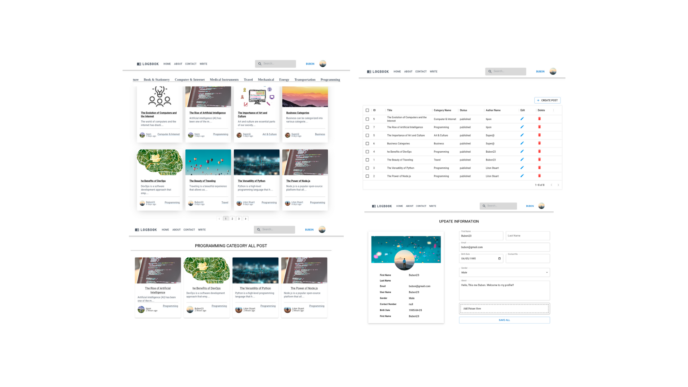
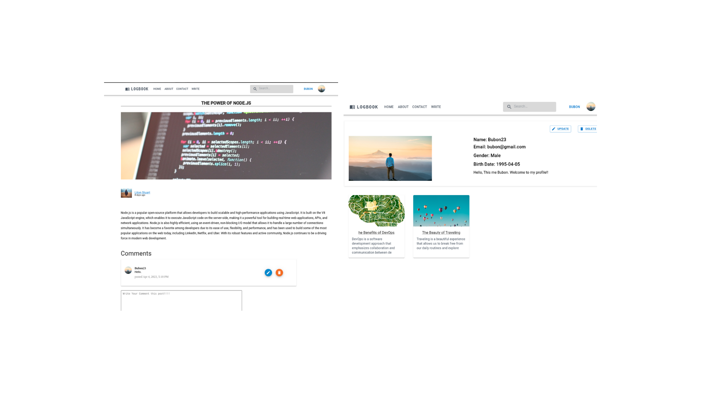

# LogBook

## Description 

It is a full-stack blog web application built with React on the frontend and Django/DRF on the backend.

## Features
- JWT authentication and authorization
- Responsive layout with reuseable component
- Category-wise blogs filtering on the home page
- Pagination of blogs
- Search functionality 
- A rich text editor for writing a blog

- User Can:
  - Login,SignUp and Logout
  - Update Profile Information
  - Delete profile
  - Create Post
  - Update and delete their created posts
  - Create Comment 
  - Delete own created Comment
  
- Admin can:
  - Create Post
  - Update any post
  - Delete any Post
  - Delete any comment

## API Documentation 
- <ins>Users</ins>:
  - `api/user/create/`  - POST
  - `api/user/logout/`  - POST
  - `api/user/profile/` - GET, PUT, DELETE
  - `api/user/{username}/` - GET
  - `api/token/` - POST
  - `api/token/refresh/` - GET
  - 

- <ins>Posts</ins>:
  - `api/post/`  - POST
  - `api/posts/` - GET
  - `api/post/{postid}` - GET, DELETE, PUT
  - `api/post/{slug}/`  - GET
  - `api/post/{author}/`- GET
  - `api/categories/`   - GET
  - `api/search/`       - GET

- <ins>Comments</ins>:
  - `api/comment` - POST
  - `api/post/{postid}/comments` - GET
  - `api/comment/{commentId}/` - PUT, DELETE

- <ins>Admin</ins>:
  - `api/admin/post` - POST
  - `api/admin/posts` - GET
  - `api/admin/post/{postid}/` - PUT, DELETE, GET

## ERD Visualized 

## Screenshots 

